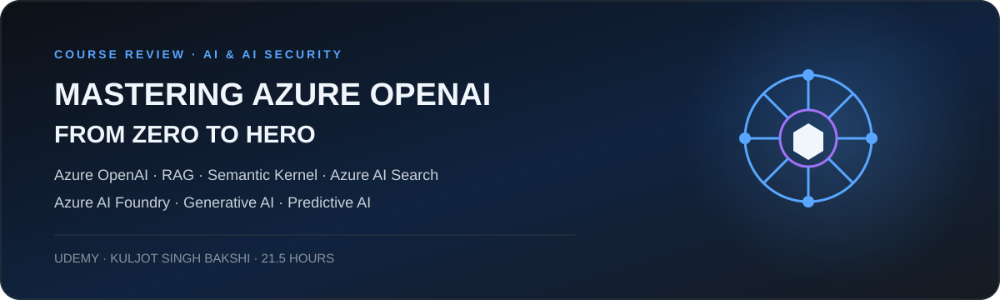
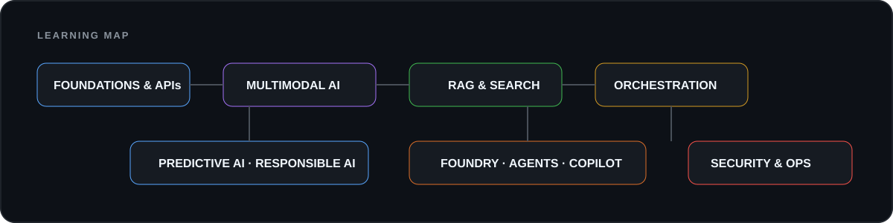

<strong>Udemy course by Kuljot Singh Bakshi</strong> Completed course review and detailed curriculum map

## At a glance

A broad, hands-on journey through the Microsoft Azure AI ecosystem. The course begins with Azure OpenAI fundamentals and APIs, then expands into multimodal models, RAG with Azure AI Search, Semantic Kernel, a full-stack Copilot project, Azure AI Foundry and agents, predictive AI services, responsible AI, security and resource operations.

The strongest value is its **breadth and practical exposure**: the curriculum combines conceptual lessons with labs in Python and C#, Azure integrations and an end-to-end application project. Because the course covers a very large surface area, some subjects function as introductions rather than deep specialist training.

**My conclusion:** recommended as a structured Azure AI survey for learners who want to understand how the main Microsoft AI services fit together and who are prepared to reinforce selected topics with documentation and personal projects.

| Provider | Instructor | Duration | Updated | Language | Course rating shown |
|:--|:--|:--|:--|:--|:--|
| Udemy | Kuljot Singh Bakshi | 21.5 hours | February 2026 | English; French auto-captions shown | 4.2/5 from 423 ratings |

**Difficulty:** Introductory → Intermediate  
**Hands-on:** High  
**Time investment:** Long  
**Verdict:** Recommended as a broad Azure AI learning path

> The public course description shown in the supplied image lists 4,461 participants and identifies Azure OpenAI, generative AI, predictive AI, Azure service integrations, prompt engineering, GitHub Copilot and Azure OpenAI security among the learning objectives.

## What the course covers

<strong>Azure OpenAI foundations, APIs and Generative AI</strong>

The opening modules establish the Azure OpenAI resource model and basic operational precautions before moving into the Chat Playground, model interaction, DALL·E and private-data chatbot scenarios.

Prompt engineering, tokens, temperature and the Chat Completions API provide the first technical foundation. The course also distinguishes Azure OpenAI from OpenAI and explores Generative AI, Predictive AI, chatbots, LLMs and LAMs.

Function calling is introduced through practical exercises involving external functions, keyword analysis, coding assistance and text summarization.

<strong>Multimodal AI, speech and video</strong>

Whisper and Azure AI Speech are used for speech-related labs.

GPT-4 and GPT-4o modules cover API calls, image description and image analysis, including integration with Azure Vision.

Sora is introduced through the video playground and a Python calling example.

<strong>RAG, Azure AI Search and Semantic Kernel</strong>

The RAG section covers embeddings, Azure AI Search, hybrid vector and keyword retrieval, a Python RAG implementation and document processing through Form Recognizer.

Semantic Kernel is presented through kernels, prompt-template plugins, native plugins and planners.

Parallel Python and C# labs provide practical exposure, followed by Web Search and Microsoft Graph plugin scenarios.

<strong>Applications, agents, Predictive AI, security and operations</strong>

A full-stack Copilot project connects front-end and back-end components with Azure infrastructure, Bing, Azure AI Search, Azure Functions and Microsoft Graph.

Azure AI Foundry, Azure AI Agent Service and OpenAI Assistants introduce tools, Code Interpreter, functions, threads and runs.

The Predictive AI modules cover text analysis, language detection, translation, NLU, question answering, speech, computer vision, OCR, image classification, Face API, Document Intelligence, Azure AI Search and custom skillsets.

The final sections address Responsible AI, Azure Content Safety, service endpoints, private endpoints, RBAC, MFA, Azure Key Vault, alerts, metrics and cost management.

## Practical assessment

<strong>Why I found the course valuable</strong>

- Broad coverage of the Azure AI ecosystem in one structured path.
- Strong practical exposure through API, Python, C#, search, orchestration and cloud-service labs.
- Useful connection between Generative AI, Predictive AI, application architecture, security and operations.
- A substantial foundation for deciding which topics deserve deeper study or personal projects.

<strong>Points to keep in mind</strong>

- The course is long and intentionally broad. Some topics are introductions rather than advanced specialist training.
- Azure AI interfaces, preview features and service names evolve quickly, so current Microsoft documentation remains important when reproducing labs.
- The course focuses on Microsoft Azure AI services rather than local or open-source model deployment.

## Curriculum

The supplied course outline contains **21 sections and 138 listed lessons**, including **50 entries explicitly labelled as a lab, hands-on exercise or demo**. Expand each section below to see the complete supplied outline.

<strong>01. Introduction</strong> · 1 lessons

• **1.** Course Introduction

<strong>02. Creating And Deploying Azure OpenAI Resource</strong> · 2 lessons

• **3.** Caution: Things To Keep In Mind
• **4.** Creating an Azure OpenAI resource

<strong>03. Chat Playground</strong> · 4 lessons

• **6.** Chatting With Our Model
• **7.** Note: UI Update for Azure OpenAI!
• **8.** Using Dall-E
• **9.** Building a ChatBot with your Private Data

<strong>04. Prompt Engineering</strong> · 2 lessons

• **11.** Introduction to Prompt Engineering
• **12.** Prompt Engineering Techniques

<strong>05. Chat Completions API</strong> · 4 lessons · 1 labs/demos

• **13.** Tokens
• **14.** Temperature
• **15.** Chat Completions API
🧪 **17.** lab1: Using Chat Completions API

<strong>06. Important Concepts</strong> · 12 lessons · 4 labs/demos

• **18.** What is Generative AI?
• **19.** What is Azure OpenAI?
• **20.** Difference between "Azure OpenAI" and "OpenAI"
• **21.** Azure OpenAi: What's The Fuss
• **22.** Functions
🧪 **24.** lab: using functions in GPT engine
🧪 **26.** lab: keyword analysis with GPT engine
🧪 **28.** lab: Using GPT Engine As Your Code Buddy
🧪 **30.** Lab: Text Summarisation
• **31.** Difference between a ChatBot and Generative AI
• **32.** Predictive AI v/s Generative AI
• **33.** LLM V/s LAM

<strong>07. The Synergistic Coexistence of Gen AI and Pred AI</strong> · 1 lessons

• **34.** The Synergistic Coexistence of Gen AI and Pred AI

<strong>08. Jargons</strong> · 1 lessons

• **35.** Jargons

<strong>09. Whisper Model And Speech Service in OpenAI</strong> · 2 lessons · 2 labs/demos

🧪 **38.** Lab On Whisper Model via Azure OpenAI
🧪 **40.** lab: using AI speech service with GPT engine

<strong>10. GPT 4</strong> · 5 lessons

• **42.** Introduction To GPT-4 engine
• **43.** Chat Playground Of GPT-4 engine
• **44.** Calling The GPT-4 Engine
• **46.** Using GPT-4 Engine To Describe an Image
• **48.** Integrating GPT-4 With Azure Vision Resource

<strong>11. GPT-4o</strong> · 3 lessons · 2 labs/demos

• **49.** Introduction to GPT-4o
🧪 **50.** Chat Completions API with GPT-4o (Hands-On Lab)
🧪 **51.** Image Analysis Using GPT-4o (Hand-On Lab)

<strong>12. Trying OpenAI SORA Video Generation Model</strong> · 2 lessons · 2 labs/demos

🧪 **52.** Lab: Testing SORA in Video Playground (Hands-On Lab)
🧪 **53.** Lab: Calling SORA via Python Script (Hands-On Lab)

<strong>13. RAG - Working With Your Own Data</strong> · 6 lessons · 4 labs/demos

• **54.** What is RAG?
🧪 **56.** lab: using embedding engine
• **57.** Intro to RAG with Azure AI Search
🧪 **58.** Lab: Hybrid Search (Vector + keyword search) With Azure AI Search Lab
🧪 **59.** Lab: Azure AI Search RAG with Python Code (Hands-On Lab)
🧪 **61.** lab: Using Form Recognizer With GPT Engine

<strong>14. Semantic Kernel : AI Orchestration Engine</strong> · 16 lessons · 10 labs/demos

• **62.** What Is Semantic Kernel?
• **63.** GitHub Repo for C#
• **64.** Plugins and Kernels
• **65.** Prompt Template Plugins
• **66.** Native Plugins
🧪 **67.** Lab1: Getting Started (Hands-On) (Python)
🧪 **68.** Lab1: Getting Started (Hands-On) (C#)
🧪 **69.** Lab2: Exploring Prompt Template Plugins (Hands-On) (Python)
🧪 **70.** Lab2: Exploring Prompt Template Plugins (Hands-On) (C#)
🧪 **71.** Lab3: Exploring Native Plugins (Hands-On) (Python)
🧪 **72.** Lab3: Exploring Native Plugins (Hands-On) (C#)
🧪 **73.** lab4: Exploring Planner (Hands-On) (Python)
🧪 **74.** Lab4: Exploring Planner (Hands-On) (C#)
🧪 **75.** lab5: WebSearcher Plugin (Hands-On)
• **76.** Microsoft Graph Plugin With Semantic Kernel Concept Video
🧪 **77.** Lab6: Microsoft Graph Plugin With Semantic Kernel Lab (Hands-On)

<strong>15. Copilot Full Stack App Project</strong> · 17 lessons

• **79.** Introduction
• **80.** Setting Up Our Device
• **81.** Discussing The Copilot Stack
• **82.** Discussing The Project's Architecture
• **83.** Launching The Front-End
• **84.** Building Infrastructure On Azure
• **85.** Setting Up A Bing Resource in Azure
• **86.** Setting Up Azure AI Search
• **87.** Running The Backend
• **88.** Setting Up Azure Function Locally
• **89.** Testing Our Project For The First Time!!!
• **90.** Activating The Microsoft Graph Plugin
• **91.** Graph Plugin Refresh Token Problem
• **92.** Understanding The Backend Code and All The API Endpoints
• **93.** Understanding Web Searcher Plugin Code
• **94.** Understanding The AI Search Plugin Code
• **95.** Understanding The Microsoft Graph Plugin Code

<strong>16. Azure AI Foundry</strong> · 3 lessons · 1 labs/demos

• **96.** Introduction to Azure AI Foundry
• **97.** Introduction to Azure AI Agent Service
🧪 **98.** Lab: Azure AI Foundry and Agent Service (Hands-On Lab)

<strong>17. Azure OpenAI Assistants</strong> · 9 lessons · 3 labs/demos

• **99.** Answering the What, Why and How?
• **100.** Understanding Tools and Code Interpretation
• **101.** Understanding Assistant Definition
• **102.** Understanding "Threads" and "Run"
• **103.** Understanding "Functions" As a Tool
• **105.** Walkthrough of OpenAI Assistants API (Preview)
🧪 **106.** Lab: Using "Code Interpreter" with Assistant
🧪 **108.** Lab Flow
🧪 **109.** Lab: Using "Functions" with Assistant

<strong>18. Predictive AI</strong> · 33 lessons · 14 labs/demos

• **110.** Introduction: Answering The What, Why And How?
• **111.** Text Analysis Service Theory
🧪 **113.** Text Analysis Lab
• **114.** AI Case Study 1: Marks And Spencer (M&S)
• **115.** What Is A Container (general definition)?
• **116.** Microsoft Container Offering
• **117.** Using Language Detection Service In A Container
• **118.** AI Case Study 2: PepsiCo
• **119.** Text Translation Service Theory
🧪 **121.** Text Translation Lab
• **122.** AI Case Study 3: Stolt-Nielsen
• **123.** Natural Language Understanding (NLU) Theory
🧪 **125.** NLU Lab
• **126.** Question Answering Theory
🧪 **127.** Lab Note
🧪 **128.** Question Answering Lab
• **129.** Speech Service Theory
🧪 **131.** Speech Service Lab
• **132.** Image Analysis Using Computer Vision Theory
🧪 **134.** Image Analysis Lab
🧪 **137.** OCR using Azure Computer Vision Lab
• **138.** Image Classification Theory
🧪 **140.** Image Classification Lab
• **141.** Face API Theory
🧪 **143.** Face API Lab
• **144.** Azure Document Intelligence Theory
🧪 **147.** Using Pre Built Document Intelligence Lab
• **148.** Custom Doc Intelligence Theory
🧪 **151.** Using Custom Document Intelligence Lab
• **152.** Azure AI Search Theory
🧪 **154.** Using Azure AI search Lab
• **155.** Skillset Theory
🧪 **157.** Using Azure AI search with custom skillset Lab

<strong>19. Responsible AI</strong> · 3 lessons · 1 labs/demos

• **158.** Fundamentals Of Responsible AI
• **159.** Understanding Azure Content Safety Studio
🧪 **160.** Azure Content Safety Studio Demo/ Hands-On Lab

<strong>20. Securing Your Azure OpenAI Resource</strong> · 7 lessons · 6 labs/demos

• **162.** Understanding Service Endpoint
🧪 **163.** Service Endpoint Demo pt.1
🧪 **164.** Service Endpoint Demo pt.2
🧪 **165.** Private Endpoint Demo
🧪 **166.** Understanding RBAC (Role-Based Access Control) with Demo
🧪 **167.** Multi Factor Authentication (MFA) with Demo
🧪 **169.** Azure Key Vault Demo

<strong>21. Azure OpenAI Resource Diagnosis</strong> · 5 lessons

• **170.** What are Alerts And Metrics?
• **171.** Configuring An Email Alert
• **172.** Viewing Resource metrics
• **173.** Using Cost Calculator
• **174.** Cost Management + Analysis

