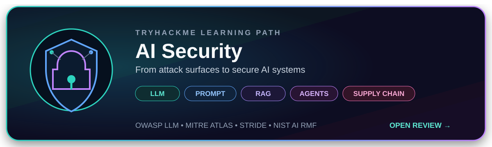
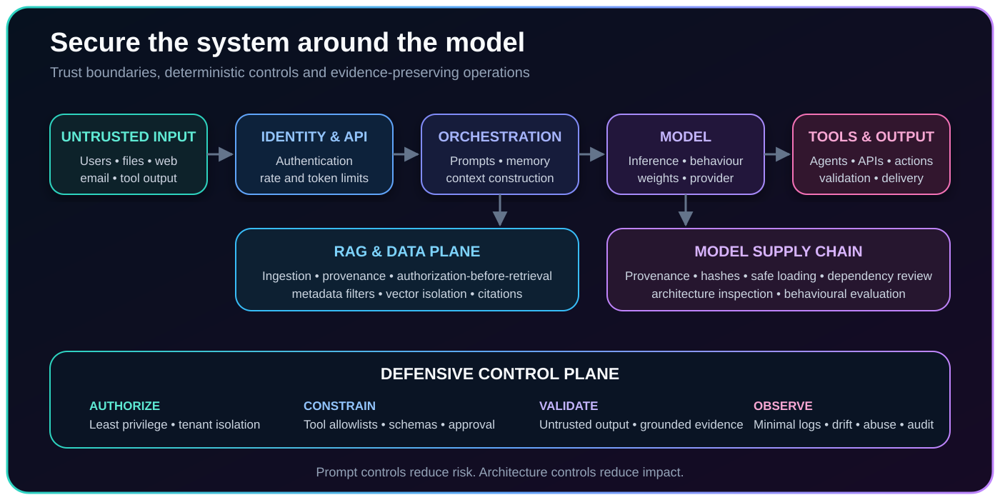

# TryHackMe AI Security Learning Path

[← Back to AI & AI Security](../../../Learning/domains/ai-ai-security.md)

  

  <strong>A practical journey from AI fundamentals to secure LLM, RAG, agent and model supply-chain architectures.</strong>

---

## Why this path matters

AI security is not limited to prompt injection. A production system combines models, prompts, retrieved content, vector stores, tools, agents, identities, APIs, dependencies and cloud infrastructure. The learning path approaches these elements as one security architecture and connects adversarial techniques with controls that reduce their impact.

The strongest lesson is simple: **the model is only one component of the attack surface**. Security decisions must account for the complete data flow, every trust boundary and the permissions granted to the application around the model.

  

---

## From attack surfaces to defensive decisions

| Security surface | What can go wrong | Why it matters | Defensive principle |
|---|---|---|---|
| **Prompts and context** | Direct or indirect instructions alter model behaviour, expose hidden instructions or persist through memory. | Untrusted language can influence a trusted workflow without exploiting conventional code. | Separate trusted instructions from external content, minimize context and constrain the consequences of model behaviour. |
| **RAG and vector stores** | Poisoned, stale or unauthorized documents enter the model context because similarity is mistaken for trust. | A relevant result may still be malicious, outdated or inaccessible to the requesting identity. | Authorize and filter before retrieval, govern ingestion, preserve provenance and expose citations. |
| **Tools and agents** | The model invokes excessive capabilities, uses broad credentials or performs a sensitive action without review. | A prompt attack becomes an operational incident only when the surrounding system grants meaningful power. | Apply least privilege, tool allowlists, deterministic authorization, strict schemas and human approval. |
| **Models and dependencies** | Malicious serialization, altered architecture or weights, poisoned data and compromised packages enter the pipeline. | A safe file format addresses only one layer of supply-chain risk. | Verify origin and integrity, inspect architecture and dependencies, quarantine artefacts and evaluate behaviour before promotion. |
| **Outputs and logs** | Generated content triggers a downstream injection or exposes sensitive prompts, retrieved documents or personal data. | Model output and observability platforms can become secondary attack and disclosure paths. | Treat output as untrusted, validate before use and record only the telemetry required for security and audit. |

---

## Frameworks as complementary lenses

| Framework | Practical use in an AI security assessment |
|---|---|
| **OWASP Top 10 for LLM Applications** | Organizes the main application risks, including prompt injection, sensitive information disclosure, supply-chain weaknesses, poisoning, improper output handling, excessive agency and unbounded consumption. |
| **MITRE ATLAS** | Provides an adversary-focused vocabulary for reconnaissance, model discovery, evasion, extraction, poisoning, prompt injection and AI supply-chain activity. |
| **STRIDE** | Forces a systematic review of identities, integrity, auditability, disclosure, availability and privilege across every AI component and trust boundary. |
| **NIST AI RMF** | Connects technical findings to governance by structuring how organizations govern, map, measure and manage AI risks. |
| **MITRE ATT&CK** | Complements AI-specific analysis with conventional adversary behaviour affecting endpoints, identities, cloud services and infrastructure around the AI system. |

No single framework is sufficient. Used together, these lenses connect architecture, adversarial behaviour, application weaknesses and organizational risk treatment.

---

## Five lessons retained

### 1. Retrieval is an authorization boundary

A vector search determines semantic proximity, not entitlement. Access control, tenant separation and document classification must be enforced before candidate documents enter retrieval and context construction. Prompt instructions cannot replace deterministic authorization.

### 2. Model output is untrusted input

Generated text may contain unsafe markup, commands, queries or malformed structured data. Output requires schema validation, encoding, sanitization and policy checks before reaching a browser, database, interpreter, API or tool.

### 3. Prompt defence is consequence reduction

A stronger prompt is useful, but it is not a complete security boundary. The decisive controls sit around the model: scoped identities, restricted tools, limited retrieval, explicit approval and monitoring of sensitive actions.

### 4. AI supply-chain security is multilayered

Scanning serialized files does not reveal every malicious architecture, altered weight, poisoned dataset or compromised dependency. Secure acquisition combines provenance, integrity checks, static inspection, sandboxing, behavioural evaluation and controlled promotion.

### 5. AI-assisted analysis remains evidence-driven

AI can accelerate CTI, vulnerability analysis, SOC investigations and incident response. Analytical conclusions still require source traceability, reproducibility, explicit uncertainty and human validation. Fluent output is not evidence.

---

## Scope of the learning path

<strong>Foundations and system architecture</strong>

The path establishes how machine learning, neural networks and large language models operate before expanding to orchestration, prompts, memory, retrieval, vector databases, tools, APIs, logging and cloud infrastructure. This system view provides the basis for identifying assets, data flows and trust boundaries.

<strong>Prompt injection, jailbreaking and prompt defence</strong>

The material distinguishes direct injection, indirect injection and jailbreaking. It examines how attacker-controlled language can enter through users, documents, webpages, email, retrieved content and tool output. Defensive coverage combines prompt hardening, input and output controls, constrained capabilities and monitoring.

<strong>RAG, data security and disclosure</strong>

The RAG modules focus on ingestion governance, authorization before retrieval, metadata filtering, tenant isolation, poisoned content, stale embeddings, vector-store exposure and disclosure through prompts or logs. The main boundary is clear: retrieval relevance does not establish authorization or source reliability.

<strong>Models, dependencies and supply-chain security</strong>

The path separates serialization-level, architecture-level and weight-level attacks, then extends the assessment to datasets, packages, repositories, model provenance and infrastructure. It emphasizes quarantine and evaluation rather than trusting an artefact because it uses a safer format.

<strong>Threat modelling, reconnaissance and operations</strong>

The practical work adapts STRIDE to AI-specific assets and uses OWASP, MITRE ATLAS, MITRE ATT&CK and NIST AI RMF as complementary lenses. Reconnaissance and monitoring exercises examine model services, registries, vector databases, notebooks, metrics endpoints and suspicious enumeration patterns.

---

## Assessment

**Verdict: strongly recommended for security professionals who already understand conventional cybersecurity and want a system-level introduction to AI security.**

The path is valuable because it connects offensive techniques to architecture and operational controls instead of treating AI security as a collection of prompt tricks. Its breadth is also its limitation: framework mappings, cloud implementation details and enterprise governance should be deepened with current primary documentation and practical architecture work.

For a background spanning security operations, incident response, vulnerability intelligence and CTI, the most useful outcome is the ability to evaluate AI systems without abandoning established security discipline: identify assets, map trust boundaries, verify provenance, constrain privilege, preserve evidence and communicate residual risk.

---

## Publication note

This review documents security concepts and analytical takeaways. It intentionally excludes challenge answers, flags, credentials, temporary laboratory addresses and step-by-step solutions.

**Source:** TryHackMe AI Security learning path and personal learning notes.

[← Back to AI & AI Security](../../../Learning/domains/ai-ai-security.md)
