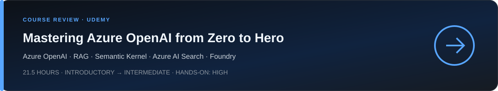

  

This section brings together my learning and practical exploration of **AI systems and AI security**, including Azure AI, LLMs, RAG, agents, orchestration, adversarial AI and secure architecture.

Content will grow over time through concise course reviews, learning paths, labs, technical notes and projects.

## Course reviews

A long and comprehensive introduction to the Azure AI ecosystem by **Kuljot Singh Bakshi**. The course combines theory with extensive hands-on work across Azure OpenAI, multimodal models, RAG and Azure AI Search, Semantic Kernel, Azure AI Foundry, agents, Predictive AI, Responsible AI, security and operations.

  <a href="./Learning/Mastering-Azure-OpenAI/README.md"><strong>Open the complete course review and expandable curriculum →</strong></a>

## Learning paths

Learning paths, including future TryHackMe content, will be added here as short clickable blocks.

## Navigation

- [Back to the main profile](../README.md)
- [Browse the cross-domain Learning Library](../Learning/README.md)
