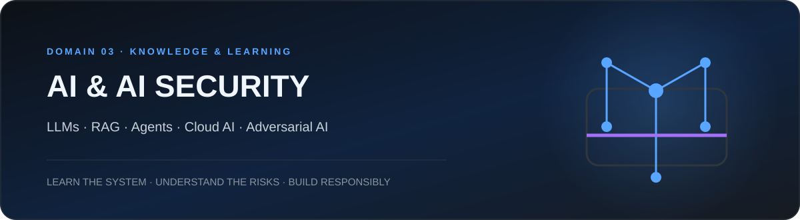
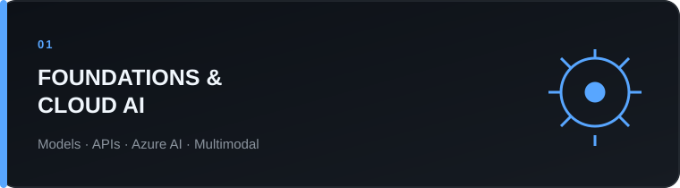
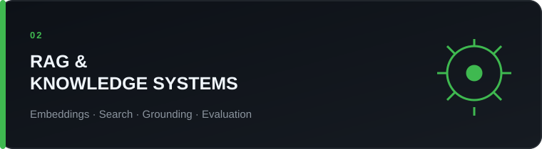
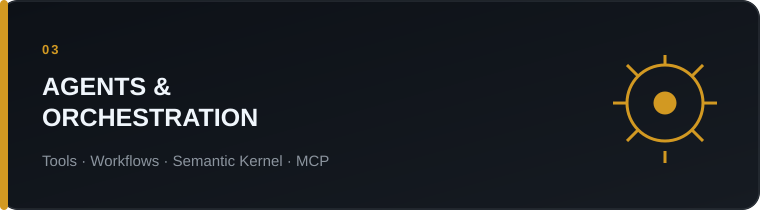
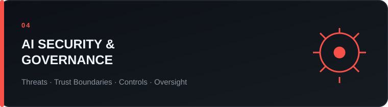

<a href="#learning-paths">Learning paths</a> · <a href="#course-reviews">Course reviews</a> · <a href="#labs--hands-on">Labs</a> · <a href="#projects">Projects</a> · <a href="#ai-security-notes">Security notes</a>

## Focus

This domain documents my learning and practical work around **modern AI systems and their security implications**.

The objective is twofold: understand how AI applications are designed and operated, then examine the trust assumptions, attack surfaces and controls introduced by models, retrieval systems, tools, agents, identities and cloud integrations.

Content will grow across courses, labs, architecture notes, security analysis and personal projects. Resources are organized by subject rather than by provider.

<table><tr><td width="50%" valign="top">  Model fundamentals, APIs, prompt engineering, multimodal systems and cloud AI services, with a strong focus on the Microsoft Azure ecosystem.</td><td width="50%" valign="top">  Embeddings, vector and hybrid search, grounding, chunking, retrieval quality, source provenance and evaluation.</td></tr><tr><td width="50%" valign="top">  Tool use, workflows, plugins, orchestration frameworks, AI agents, human approval and controlled automation.</td><td width="50%" valign="top">  Prompt injection, data exposure, excessive agency, identity, supply-chain risks, monitoring, governance and secure architecture.</td></tr></table>

## Learning paths

### Azure AI and Generative AI

A progression from Azure OpenAI fundamentals to RAG, Azure AI Search, Semantic Kernel, Azure AI Foundry, agents, predictive AI services, responsible AI and security.

### Secure RAG systems

A future path covering source ingestion, document processing, embeddings, retrieval, grounding, citations, evaluation, access control and protection against untrusted content.

### AI agents and controlled automation

A future path covering tools, plugins, memory, permissions, human validation, auditability, prompt injection and safe execution boundaries.

## Course reviews

### Mastering Azure OpenAI from Zero to Hero

**Provider:** Udemy  
**Instructor:** Kuljot Singh Bakshi  
**Duration:** 21.5 hours  
**Difficulty:** Introductory → Intermediate  
**Hands-on:** High  
**Verdict:** Recommended as a broad Azure AI learning path

A wide-ranging, hands-on course covering Azure OpenAI fundamentals, prompt engineering, Chat Completions, function calling, multimodal models, RAG with Azure AI Search, Semantic Kernel, a full-stack Copilot application, Azure AI Foundry, agents, predictive AI, responsible AI, security and operations.

<a href="./Learning/Mastering-Azure-OpenAI/README.md"><strong>Read the complete review and curriculum →</strong></a>

> Add future courses here as short cards. The detailed pages remain inside `Learning/`, while this page becomes the browsable AI knowledge index.

## Labs & hands-on

This area will index practical work by learning objective rather than by platform:

- Azure OpenAI API and model interaction;
- multimodal analysis;
- embeddings and hybrid retrieval;
- RAG with Azure AI Search;
- Semantic Kernel plugins and planners;
- Azure AI Foundry and agent experiments;
- AI security and prompt-injection testing.

## Projects

### Secure CTI RAG

A planned assistant for source-grounded Cyber Threat Intelligence exploration, with citations, structured extraction, conservative analysis and source governance.

### AI-Assisted Vulnerability Intelligence

A planned workflow combining vulnerability data, public exploitation signals and contextual relevance while preserving evidence and analyst validation.

### Controlled SOC Assistant

A planned analyst-support workflow focused on investigation hypotheses, recommended telemetry and human-approved actions rather than autonomous destructive operations.

## AI security notes

Future notes will cover:

- direct and indirect prompt injection;
- retrieval poisoning and untrusted documents;
- excessive agency and tool permissions;
- secrets, tokens and identity boundaries;
- model and dependency supply-chain risks;
- data leakage and cross-tenant exposure;
- monitoring, auditability and evaluation;
- MITRE ATLAS and other AI threat frameworks.

## Navigation

- [Back to the main profile](../README.md)
- [Browse the cross-domain Learning Library](../Learning/README.md)
- [Open the Azure OpenAI course review](./Learning/Mastering-Azure-OpenAI/README.md)
