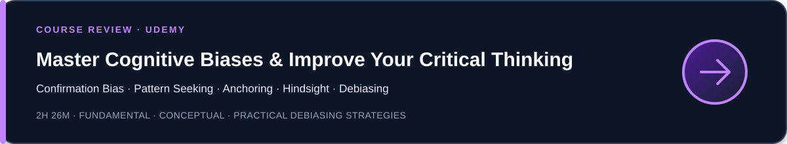
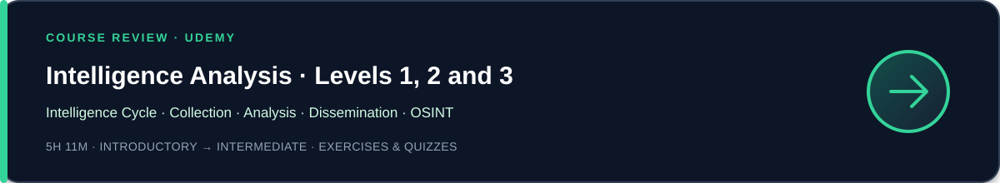

# Learning & Resources

Courses, labs, documentation, research papers, certifications, and practical
resources across my cybersecurity learning domains.

Resources are documented to show what they actually cover, their practical
value, limitations, and the audience most likely to benefit.

---

  

<strong>Design & Build Test Framework with Python Pytest | API Tests</strong>

 

A practical course on designing a modular, data-driven and reusable test automation framework with **Python**, **Pytest** and **REST API testing**.

Topics covered include framework architecture, utilities, configuration and test-data management, parameterized tests, setup and teardown, fixture scopes, logging, reporting and Allure.

**My take:** The Python and API introductions are basic for experienced developers and can be reviewed quickly. The strongest value is the quality-engineering perspective on structuring an extensible and maintainable test framework.

**Practical application:** I applied these principles to my CTI vulnerability-intelligence project through API collector tests, reusable fixtures, parametrization, mocked network behaviour, deterministic test data and CI validation.

---

## Critical Thinking & Decision-Making

An engaging and accessible introduction to cognitive biases and their impact
on judgement, decision-making, and critical thinking. The course explains four
biases in depth and presents practical strategies for reducing narrow or
systematically distorted thinking.

The subject is general rather than cybersecurity-specific, but the concepts
are directly relevant to analytical work, including CTI, OSINT, vulnerability
intelligence, incident analysis, and security decision-making.

<strong>Open the complete course review →</strong>

 

### Course scope

The course explains what cognitive biases are, why they matter for critical
thinking, why organizations increasingly provide cognitive-bias training, and
how debiasing methods can improve judgement and decision-making.

### Biases covered in depth

- Confirmation bias
- Pattern seeking
- Anchoring effect
- Hindsight bias

### Debiasing strategies

- Consider the opposite
- Make decision-makers accountable
- Premortem analysis
- Use checklists
- Improve group decision-making
- Use diversity to challenge narrow thinking
- Structure brainstorming more effectively

### Strengths

- Clear distinction between cognitive bias and prejudice
- Accessible explanation of how biases affect memory, information searches,
  interpretation, prediction, and judgement
- Strong practical focus on debiasing rather than merely listing biases
- Broad applicability across professional and personal decision-making
- Useful examples showing how irrelevant information can influence conclusions
- Valuable treatment of organizational resistance and the bias blind spot

### Limitations

- The course focuses on four biases rather than providing a broad catalogue
- Examples are general and not specific to cybersecurity or intelligence work
- The course is primarily conceptual and does not include analytical labs
- Applying the techniques to CTI or OSINT requires domain-specific workflows
  and controls

### Relevance to intelligence and CTI

The course is particularly useful for reducing analytical errors such as:

- searching only for evidence that supports active exploitation
- interpreting ambiguous signals according to an initial theory
- overvaluing the first CVSS score, article, or vendor statement encountered
- seeing meaningful campaigns or coordination in weak patterns
- treating outcomes as predictable after the facts are known
- accepting automated classifications without sufficient challenge

Useful controls for intelligence work include:

- actively seeking disconfirming evidence
- documenting alternative hypotheses
- performing premortem analysis before important decisions
- using repeatable analytical checklists
- making assumptions and confidence explicit
- requiring review and accountability for sensitive conclusions

### Verdict

**Recommended as a practical introduction to cognitive biases and debiasing for
anyone seeking to improve critical thinking and decision quality.**

The course is not designed for CTI, but its methods transfer well to source
evaluation, hypothesis testing, vulnerability prioritization, attribution,
indicator assessment, and intelligence reporting.

 

---

## Intelligence Analysis

A progressive course on intelligence analysis designed primarily for military,
law-enforcement, and intelligence-community audiences. It covers the
intelligence cycle, analytical techniques, collection disciplines, source
evaluation, and intelligence dissemination.

Several methodological concepts are transferable to CTI, OSINT,
physical-threat analysis, and corporate intelligence. However, this is a
general intelligence-analysis course, not a Cyber Threat Intelligence
specialization.

<strong>Open the complete course review →</strong>

 

### Course structure

- **Level 1:** introduction and intelligence cycle
- **Level 2:** analytical techniques, intelligence sources, and dissemination
- **Level 3:** predictive analysis, targeting, and threat intelligence

The programme includes assignments, quizzes, a HUMINT scenario, and a final
two-page intelligence-analysis exercise.

### Main topics

- Direction, collection, processing, and dissemination
- SWOT, network, pattern, PESTEL, and PMESII-ASCOPE analysis
- Source evaluation and assessment
- HUMINT, OSINT, IMINT, and surveillance
- Briefing, written, and graphical dissemination
- Predictive analysis, human terrain, targeting, and threat intelligence

### Strengths

- Complete overview of the intelligence cycle
- Strong connection between direction, collection, analysis, and dissemination
- Useful introduction to source evaluation and collection disciplines
- Multiple analytical frameworks in one curriculum
- Exercises and quizzes supporting knowledge validation
- Methods transferable to OSINT, strategic intelligence, and CTI

### Limitations

- Primarily military and law-enforcement perspective
- Cyber Threat Intelligence is only a small part of the curriculum
- Several frameworks are introduced rather than deeply practised
- HUMINT, surveillance, and targeting are less directly applicable to corporate CTI
- UK surveillance legislation has limited applicability outside that context
- No significant coverage of ATT&CK mapping, STIX/TAXII, indicators,
  detection engineering, or CTI platforms

### Verdict

**Recommended for learners seeking a broad foundation in intelligence
analysis, particularly in military or law-enforcement contexts.**

For CTI practitioners, the principal value lies in the transferable methods:
direction, collection, processing, source assessment, analysis, and
dissemination.

 

---

## Cyber Threat Intelligence

### Cyber Threat Intelligence by Christopher Nett

A broad and clearly structured introduction to Cyber Threat Intelligence,
covering CTI and SOC operations, MITRE ATT&CK, threat actors, intelligence
platforms, Microsoft Sentinel, and the foundations of a CTI program.

<strong>Open the complete course review →</strong>

 

### Course scope

- SOC, Azure, and Zero Trust fundamentals
- Intelligence and Cyber Threat Intelligence
- CTI-related frameworks and MITRE ATT&CK
- Threat actors and Advanced Persistent Threats
- CTI tools and platforms
- Artificial Intelligence applied to CTI
- MISP on Azure and Microsoft Sentinel
- APT41 research and CTI-program development

### Strengths

- Clear progression across the principal CTI concepts
- Useful introduction to the relationship between CTI and SOC operations
- Accessible overview of MITRE ATT&CK
- Relevant Microsoft Sentinel and Azure examples
- Broad introduction to CTI tools and platforms

### Limitations

- Most subjects remain introductory
- Strong Microsoft and Azure orientation
- Limited depth on OSINT tradecraft and source evaluation
- Limited treatment of confidence and uncertainty
- Little emphasis on structured analytical techniques
- More product demonstration than hands-on intelligence work

### Verdict

**Recommended as a structured introduction to CTI, particularly for
professionals working in the Microsoft ecosystem.**

For experienced analysts, the course is more useful as a refresher and
curriculum overview than as advanced CTI training.

 

### MITRE ATT&CK Fundamentals

A concise official introduction to the ATT&CK knowledge base, its terminology,
its defensive value, and its application across CTI, detection engineering,
adversary emulation, security assessments, and threat-informed defence.

<strong>Open the complete training review →</strong>

 

### Curriculum

#### Module 1: Understanding ATT&CK

- Matrices and platforms
- Tactics, techniques, and sub-techniques
- Mitigations, data sources, and detections
- Groups, software, and ATT&CK evolution

#### Module 2: Benefits of Using ATT&CK

- Community perspective
- Common language
- Quantitative scorecard
- ATT&CK Navigator

#### Module 3: Operationalizing ATT&CK

- Cyber Threat Intelligence
- Analytics and detection
- Adversary emulation and red teaming
- Assessments, engineering, and threat-informed defence

### Strengths

- Official terminology and reference baseline
- Clear distinction between ATT&CK objects
- Concise overview of ATT&CK Navigator
- Connection between CTI, detection, emulation, and engineering

### Limitations

- Deliberately fundamental and conceptual
- No substantial hands-on exercises
- Limited depth for practitioners already using ATT&CK
- No practical mapping exercises with reports or raw incident data

### Verdict

**Recommended as an official foundation and terminology reference for
professionals discovering ATT&CK.**

The dedicated MITRE ATT&CK CTI Training is the more appropriate next step for
practical mapping, analysis, Navigator comparisons, and defensive
recommendations.

### Next step

[MITRE ATT&CK CTI Training](https://attack.mitre.org/resources/learn-more-about-attack/training/cti/)

 
