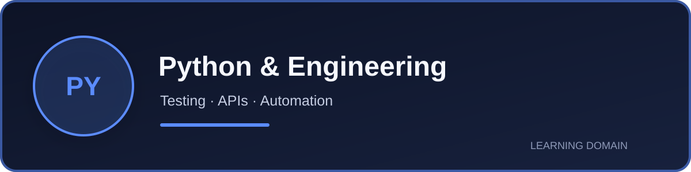
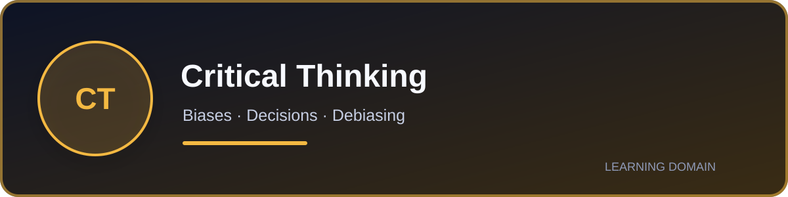
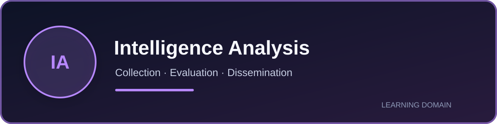
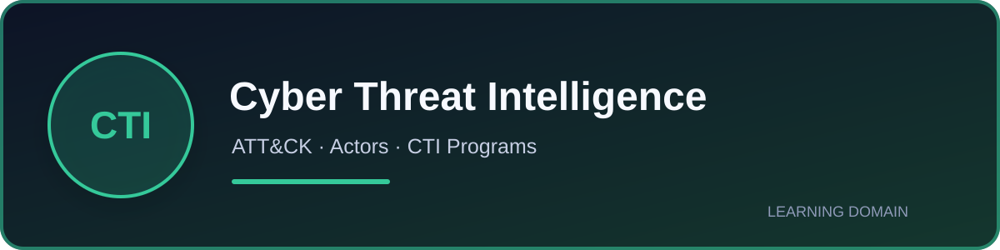

# Learning & Resources

Courses, labs, documentation, research papers, certifications, and practical resources across my cybersecurity learning domains.

Resources are documented to show what they actually cover, their practical value, limitations, and the audience most likely to benefit.

## Explore by domain

## Recently completed

- **[MITRE ATT&CK for Cyber Threat Intelligence](domains/cyber-threat-intelligence.md#mitre-attck-for-cyber-threat-intelligence)**  
  Practical ATT&CK training covering mappings from narrative reporting and raw data, analytical bias, structured storage, Navigator comparisons, and defensive recommendations.

## How this section is organized

- **Domain pages** contain detailed reviews, practical applications, strengths, limitations, and verdicts.
- **Substantial courses and learning paths** retain individual visual review cards.
- **Short modules and event sessions** are grouped into compact reference lists at the end of the relevant domain page.
- **Practical application** links learning outcomes to projects, laboratories, and repeatable analytical workflows.
