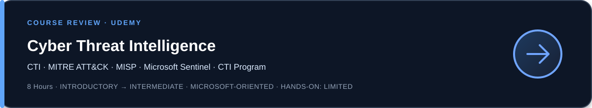
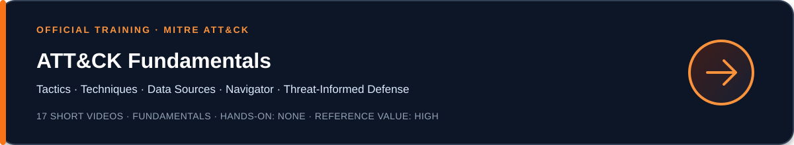

# Learning & Resources

Courses, labs, documentation, research papers, certifications, and practical
resources across my cybersecurity learning domains.

Resources are documented to show what they actually cover, what I found useful,
their limitations, and the audience most likely to benefit.

---

## Intelligence Analysis

  

A progressive introduction to the complete intelligence cycle, analytical
techniques, collection disciplines, source evaluation, and intelligence
dissemination.

**Best suited for:** learners entering intelligence analysis and practitioners
who want a structured review of general intelligence methods.  
**My verdict:** useful for understanding the foundations shared by military,
law-enforcement, physical-threat, OSINT, and cyber-intelligence disciplines,
but not a dedicated Cyber Threat Intelligence course.

<strong>Open the complete course review →</strong>

 

### Course structure

The course combines three progressive levels:

- **Level 1:** introduction and intelligence cycle
- **Level 2:** analytical techniques, intelligence sources, and dissemination
- **Level 3:** advanced concepts, predictive analysis, targeting, and threat
  intelligence

The programme includes assignments, questionnaires, a HUMINT scenario, and a
final two-page intelligence-analysis exercise.

### Intelligence cycle

- Introduction to intelligence
- Direction
- Collection
- Processing
- Dissemination

### Analytical techniques

- SWOT analysis
- Network analysis
- Pattern analysis
- PESTEL analysis
- PMESII-ASCOPE

### Sources and collection disciplines

- Source evaluation and assessment
- Types of intelligence sources
- Human Intelligence
- HUMINT questioning techniques
- Open-Source Intelligence
- Imagery Intelligence
- Surveillance
- UK surveillance legislation

### Dissemination

- Briefing techniques
- Written dissemination
- Graphical dissemination

### Advanced concepts

- Predictive analysis
- Human terrain analysis
- Human security
- Intelligence-led targeting
- Threat intelligence

### What I found useful

- Complete overview of the intelligence cycle
- Strong connection between requirements, collection, analysis, and
  dissemination
- Useful introduction to source evaluation and collection disciplines
- Multiple analytical frameworks presented in one curriculum
- Coverage of written, graphical, and oral dissemination
- Assignments and quizzes supporting knowledge validation
- Methods transferable to CTI, OSINT, physical-threat analysis, and strategic
  intelligence

### Limitations

- The primary perspective is military and law enforcement
- Cyber Threat Intelligence is only one small part of the curriculum
- Some concepts are intentionally repeated across the three levels
- Several analytical frameworks are introduced more than deeply practised
- HUMINT, surveillance, and targeting sections are less directly applicable
  to a corporate CTI role
- UK surveillance legislation has limited applicability outside that legal
  context
- The course does not cover ATT&CK mapping, STIX/TAXII, technical indicators,
  detection engineering, or CTI platforms in depth

### Application to my CTI work

The most transferable elements are:

- defining intelligence requirements;
- separating collection from analysis;
- assessing sources and information;
- maintaining a structured intelligence cycle;
- selecting analytical techniques according to the question;
- communicating findings to different audiences;
- distinguishing data, information, and actionable intelligence.

These elements support the methodology of my vulnerability-intelligence
project, particularly:

- Priority Intelligence Requirements;
- collection requirements;
- source evaluation;
- analytical confidence;
- structured reporting;
- proportionate recommendations.

### Final assessment

**Recommended for building or validating a general intelligence-analysis
foundation.**

The course is broader than Cyber Threat Intelligence and should be presented
as an Intelligence Analysis course rather than a CTI specialization.

For a CTI practitioner, its principal value lies in the transferable
methodology: direction, collection, processing, source assessment, analysis,
and dissemination.

 

---

## Cyber Threat Intelligence

  

A clear and well-organized introductiont actors, intelligence platforms,
Microsoft Sentinel, and the foundations of a CTI program.

**Best suited for:** beginners and SOC analysts moving toward CTI.  
**My verdict:** useful as a structured overview, but too introductory and
Microsoft-oriented for experienced CTI practitioners.

<strong>Open the complete course review →</strong>

 

### Course scope

The course covers:

- SOC fundamentals
- Microsoft Azure fundamentals
- Zero Trust fundamentals
- Intelligence and Cyber Threat Intelligence
- CTI-related frameworks
- MITRE ATT&CK
- Threat actors and Advanced Persistent Threats
- CTI tools and platforms
- Artificial Intelligence applied to CTI
- MISP deployment on Microsoft Azure
- APT41 research using MITRE ATT&CK
- CTI integration with Microsoft Sentinel
- Fundamental considerations for building a CTI program

### What I found useful

- Clear progression across the principal CTI concepts
- Good introduction to the relationship between CTI and SOC operations
- Accessible overview of MITRE ATT&CK
- Useful Microsoft Sentinel and Azure examples
- Broad introduction to CTI tools and platforms
- Relevant starting point for professionals discovering CTI

### Limitations

- Most subjects remain introductory
- Strong Microsoft and Azure orientation
- Limited depth on OSINT tradecraft and source evaluation
- Limited treatment of analytical confidence and uncertainty
- Little emphasis on structured analytical techniques
- Tool coverage is broader than the practical hands-on work
- Experienced SOC or CTI practitioners may find much of the content familiar

### Final assessment

**Recommended as a structured introduction to CTI, particularly for
professionals working in the Microsoft ecosystem.**

For an experienced analyst, the course is better used as a refresher and
curriculum overview than as advanced CTI training.

It should be complemented by deeper learning in:

- Priority Intelligence Requirements
- Collection planning
- Source reliability and information credibility
- Structured analytical techniques
- Analytical confidence
- OSINT investigation
- Threat actor clustering and attribution
- Vulnerability intelligence
- CTI automation

  

The official MITRE ATT&CK Fundamentals curriculum provides a concise overviewngineering, adversary emulation, assessments, and
threat-informed defence.

**Completion:** the three official core modules were completed. The complete
17-video curriculum was reviewed and retained as a reference because most
fundamental concepts were already familiar from professional use.

<strong>Open the complete training review →</strong>

 

### Curriculum

The 17-video series is organized into three modules.

#### Module 1: Understanding ATT&CK

- Introduction to ATT&CK
- Matrices and platforms
- Tactics
- Techniques and sub-techniques
- Mitigations
- Data sources and detections
- Groups and software
- How ATT&CK grows and evolves

#### Module 2: Benefits of Using ATT&CK

- Community perspective
- Common language
- Quantitative scorecard
- ATT&CK Navigator

#### Module 3: Operationalizing ATT&CK

- Cyber Threat Intelligence
- Analytics and detection
- Adversary emulation and red teaming
- Assessments and engineering
- Threat-informed defence

### What I found useful

- Clear validation of the principal ATT&CK concepts
- Useful distinction between tactics, techniques, sub-techniques, groups,
  software, mitigations, and data sources
- Concise overview of ATT&CK Navigator
- Good introduction to connecting CTI with detection, emulation, and
  defensive engineering
- Official MITRE terminology suitable as a reference baseline

### Limitations

- The content is deliberately fundamental
- Videos are very short and primarily conceptual
- No substantial hands-on exercises
- Limited additional value for practitioners already using ATT&CK
- Less analytical depth than the dedicated MITRE CTI training
- No practical mapping exercises using reports or raw incident data

### Verdict

**Recommended as a short, official ATT&CK foundation and terminology
reference.**

For practitioners already using ATT&CK, completing the three core modules
and consulting the detailed videos selectively is sufficient. Watching all
17 videos provides limited additional value when the underlying concepts
are already mastered.

The more valuable next step is the dedicated MITRE ATT&CK CTI Training,
which includes mapping exercises, raw-data analysis, Navigator comparisons,
and defensive recommendations.

### Next step

[MITRE ATT&CK CTI Training](https://attack.mitre.org/resources/learn-more-about-attack/training/cti/)

 
