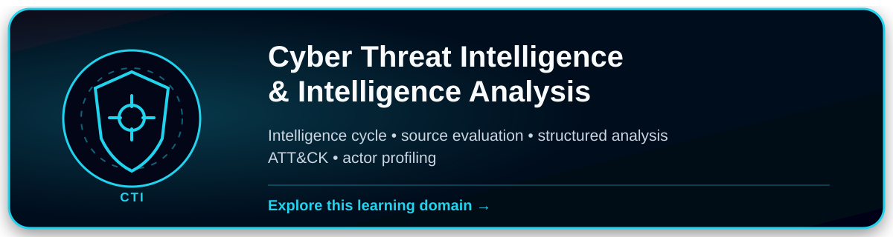
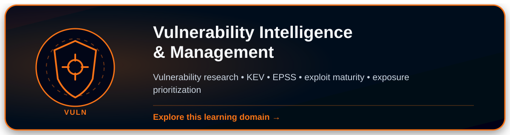
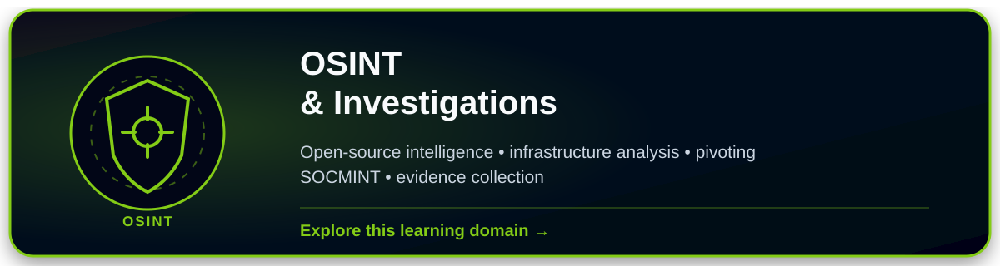
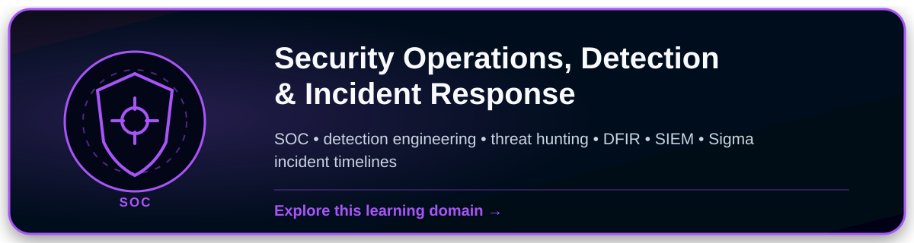
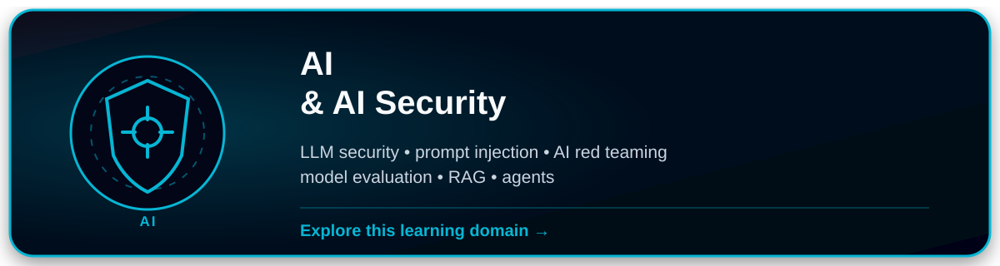
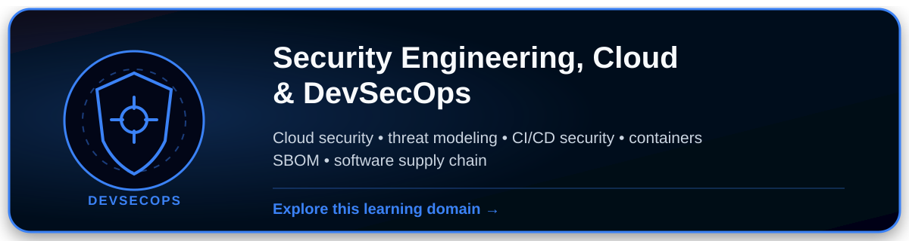
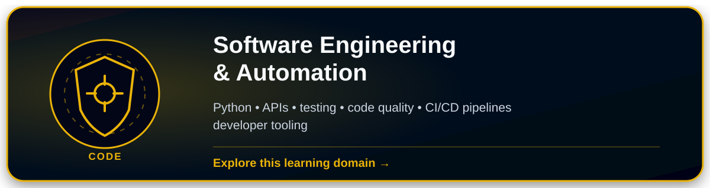
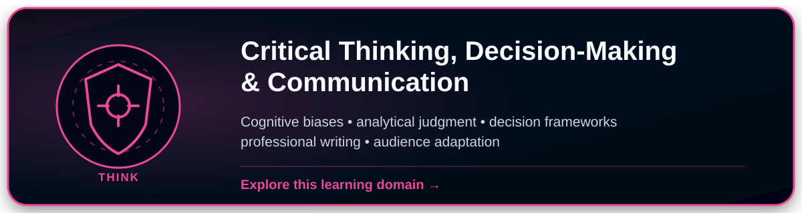

# Learning & Resources

Courses, labs, documentation, research papers, certifications, and practical resources across my cybersecurity learning domains.

Resources are documented to show what they actually cover, their practical value, limitations, and the audience most likely to benefit.

## Explore by domain

  

  

  

  

  

  

  

  

  

