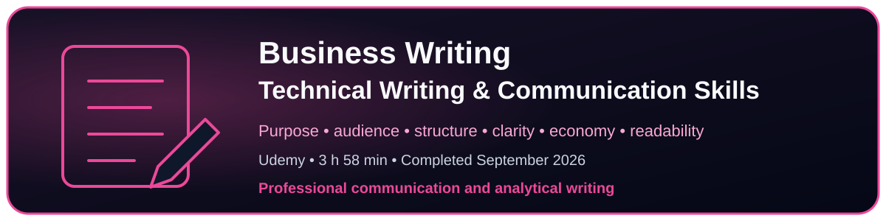

# Critical Thinking, Decision-Making & Communication

[← Back to Learning domains](../README.md)

Learning focused on cognitive biases, analytical judgment, decision-making, professional writing, audience adaptation, and the clear communication of complex information.

---

An engaging and accessible introduction to cognitive biases and their impact on judgement, decision-making, and critical thinking. The course explains four biases in depth and presents practical strategies for reducing narrow or systematically distorted thinking.

The subject is general rather than cybersecurity-specific, but the concepts are directly relevant to analytical work, including CTI, OSINT, vulnerability intelligence, incident analysis, and security decision-making.

<strong>Open the complete course review →</strong>

 

### Course Scope

The course explains what cognitive biases are, why they matter for critical thinking, why organizations increasingly provide cognitive-bias training, and how debiasing methods can improve judgement and decision-making.

### Biases Covered in Depth

- Confirmation bias
- Pattern seeking
- Anchoring effect
- Hindsight bias

### Debiasing Strategies

- Consider the opposite
- Make decision-makers accountable
- Premortem analysis
- Use checklists
- Improve group decision-making
- Use diversity to challenge narrow thinking
- Structure brainstorming more effectively

### Strengths

- Clear distinction between cognitive bias and prejudice
- Accessible explanation of how biases affect memory, information searches, interpretation, prediction, and judgement
- Strong practical focus on debiasing rather than merely listing biases
- Broad applicability across professional and personal decision-making
- Useful examples showing how irrelevant information can influence conclusions
- Valuable treatment of organizational resistance and the bias blind spot

### Limitations

- The course focuses on four biases rather than providing a broad catalogue
- Examples are general and not specific to cybersecurity or intelligence work
- The course is primarily conceptual and does not include analytical labs
- Applying the techniques to CTI or OSINT requires domain-specific workflows and controls

### Relevance to Intelligence and CTI

The course is particularly useful for reducing analytical errors such as:

- searching only for evidence that supports active exploitation
- interpreting ambiguous signals according to an initial theory
- overvaluing the first CVSS score, article, or vendor statement encountered
- seeing meaningful campaigns or coordination in weak patterns
- treating outcomes as predictable after the facts are known
- accepting automated classifications without sufficient challenge

Useful controls for intelligence work include:

- actively seeking disconfirming evidence
- documenting alternative hypotheses
- performing premortem analysis before important decisions
- using repeatable analytical checklists
- making assumptions and confidence explicit
- requiring review and accountability for sensitive conclusions

### Verdict

**Recommended as a practical introduction to cognitive biases and debiasing for anyone seeking to improve critical thinking and decision quality.**

The course is not designed for CTI, but its methods transfer well to source evaluation, hypothesis testing, vulnerability prioritization, attribution, indicator assessment, and intelligence reporting.

 

---

  

A structured course on producing clear, concise, purposeful, and audience-aware professional documents across emails, reports, executive summaries, technical documentation, proposals, and presentations.

<strong>Business Writing: Technical Writing & Communication Skills</strong>

 

**Provider:** Udemy  
**Instructors:** Starweaver Group, Paul Siegel, and Daniel Graham  
**Completed:** September 2026  
**Duration:** 3 hours 58 minutes  
**Focus:** Business writing, technical documentation, and professional communication

### Overview

This course presents a structured writing system for producing clear, concise, and purposeful professional documents. It covers the complete writing process, from defining the purpose and audience to outlining, drafting, revising, editing, and proofreading.

The methodology applies to business emails, reports, executive summaries, recommendations, technical documentation, proposals, and presentations.

### The Writing System

The course organizes professional writing into a repeatable process:

1. Analyze purpose
2. Analyze audience
3. Write the purpose statement
4. Gather information
5. Write a sentence outline
6. Draft
7. Revise content and organization
8. Edit for coherence
9. Edit for clarity
10. Edit for economy
11. Edit for readability
12. Check correctness and proofread

### Key Learning Outcomes

- Define the purpose and intended outcome before drafting.
- Adapt terminology, evidence, and level of detail to the audience.
- Distinguish the needs of experts, managers, and operators.
- Build sentence outlines before writing complete paragraphs.
- Put findings, conclusions, or recommendations before supporting details.
- Separate content intended for different audiences.
- Improve coherence through structure, transitions, parallel lists, and visual aids.
- Replace vague or ambiguous language with concrete and precise wording.
- Use active verbs and simpler sentence structures.
- Edit important documents for clarity, economy, readability, and correctness.
- Use executive summaries and technical appendices for mixed audiences.
- Preserve human judgment when using writing and AI-assisted tools.

### Application to Cyber Threat Intelligence

The course strengthens the production and dissemination stages of the intelligence lifecycle. The same analytical assessment can support different deliverables without changing the underlying evidence, judgment, limitations, or confidence level.

Examples include:

- concise operational briefings for SOC analysts;
- remediation-oriented reports for vulnerability management teams;
- executive summaries focused on business impact and decisions;
- technical appendices preserving evidence, limitations, and methodology;
- clear separation between facts, analytical judgments, assumptions, and recommendations.

### Strengths

- A complete and repeatable writing process rather than isolated writing tips
- Strong emphasis on purpose and audience before drafting
- Practical guidance for point-first paragraphs and skimmable documents
- Useful distinction between findings, opinions, evidence, and supporting detail
- Concrete editing techniques for coherence, clarity, economy, and readability
- Direct relevance to technical reports and executive communication

### Limitations

- The course is not specific to cybersecurity or intelligence analysis
- Some grammar and ESL material is introductory for experienced professionals
- The method still requires domain expertise to determine what evidence and judgment belong in a CTI report
- Persuasive writing techniques must not be used to overstate confidence or conceal analytical limitations

### Practical Takeaway

Effective analytical writing does not mean adding more information. It means selecting, structuring, and presenting the information required by a specific audience to understand the assessment and make a decision.

### Verdict

**Recommended as a practical and structured foundation for professional and technical writing.**

Its strongest value for CTI is the disciplined connection between purpose, audience, evidence, document structure, clarity, and decision-oriented communication.

