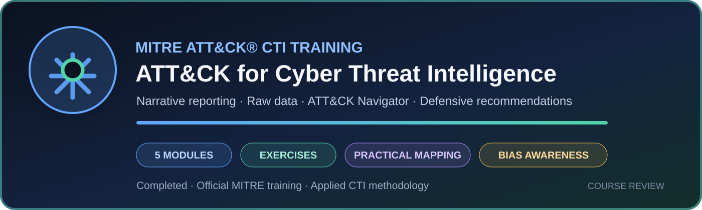

## MITRE ATT&CK for Cyber Threat Intelligence



A practical official MITRE training on using ATT&CK throughout the CTI workflow: identifying adversary behaviours, mapping narrative reporting and raw data, preserving useful analytical context, comparing mapped intelligence, and turning analysis into tailored defensive recommendations.

The training is substantially more technical and applied than ATT&CK Fundamentals. Its exercises require the analyst to make and justify mapping decisions rather than simply recognize ATT&CK terminology.

<details>
<summary><strong>Open the complete training review →</strong></summary>

<br>

### Training format

- Five modules combining videos, slides, and practical exercises
- Guided and unguided mapping exercises using narrative reporting
- Raw incident data exercises
- ATT&CK Navigator layer comparison
- Defensive-recommendation exercise

### Curriculum

#### Module 0: Introduction

- Why ATT&CK is useful for CTI
- Using adversary behaviour to inform defenders
- Comparing groups and behaviour over time
- Communicating through a common language

#### Module 1: Mapping to ATT&CK from Narrative Reporting

- Challenges, advantages, and prerequisites of ATT&CK mapping
- Finding and researching adversary behaviours in finished reporting
- Translating behaviours into tactics
- Identifying techniques and sub-techniques
- Mapping a narrative report
- Recognizing analyst and source bias and hedging against them

#### Module 2: Mapping to ATT&CK from Raw Data

- Process of mapping from raw data
- Identifying and researching behaviours across technical data sources
- Translating behaviours into tactics, techniques, and sub-techniques
- Considering concurrent techniques
- Peer review and collaboration
- Converting raw observations into narrative reporting

#### Module 3: Storing and Analyzing ATT&CK-Mapped Intelligence

- Storing and displaying ATT&CK-mapped data
- Choosing the level of detail and context appropriate to consumers
- Expressing mapped intelligence in reports and structured systems
- Analyzing ATT&CK-mapped data
- Comparing threat-actor layers in ATT&CK Navigator

#### Module 4: Making ATT&CK-Mapped Data Actionable with Defensive Recommendations

- Determining priority techniques and sub-techniques
- Researching how behaviours are used and which defensive options exist
- Evaluating organizational capabilities and constraints
- Considering practical trade-offs
- Producing customized defensive recommendations

### Practical exercises

The exercises are a major strength of the training. They include:

- mapping behaviours from guided and unguided threat reports
- working from simulated raw incident tickets
- comparing ATT&CK Navigator layers
- researching defensive options
- adapting recommendations to organizational capabilities and constraints

### Analytical value

The training reinforces several important analytical controls:

- map observed behaviour rather than isolated keywords
- research unfamiliar technical behaviour before assigning a technique
- distinguish tactics from techniques and sub-techniques
- preserve procedure-level context when storing mapped intelligence
- compare results with other analysts
- account for the bias already present in source reporting
- actively hedge against personal analytical bias
- avoid turning ATT&CK mapping into unsupported attribution or false precision

The treatment of bias in Module 1 is particularly valuable. ATT&CK mapping is not a purely mechanical classification exercise: source selection, prior assumptions, missing context, and an analyst's initial interpretation can all influence the result. Peer review, alternative mappings, and explicit uncertainty help reduce that risk.

### Strengths

- Official and methodical ATT&CK mapping process
- Practical distinction between narrative reporting and raw technical data
- Exercises that require actual analytical decisions
- Strong focus on behaviour rather than indicators alone
- Useful treatment of analyst and source bias
- Clear guidance on preserving context when storing mapped data
- Practical ATT&CK Navigator comparison exercise
- Direct progression from intelligence analysis to defensive recommendations
- Explicit attention to organizational constraints and trade-offs

### Limitations

- Exercises use an older ATT&CK version, so exact results may differ in the current knowledge base
- The training assumes prior knowledge of ATT&CK fundamentals
- Several examples are guided and should be complemented with independent mapping practice
- The course teaches the process but does not replace deep expertise in every underlying data source or platform
- Defensive recommendations still require current knowledge of the organization's telemetry, controls, architecture, and operational constraints

### Practical application

The training directly supports my CTI projects by reinforcing a disciplined chain from evidence to action:

```text
source material
→ observed behaviour
→ technical research
→ tactic
→ technique or sub-technique
→ procedure-level context
→ confidence and peer review
→ structured storage
→ analysis and comparison
→ defensive recommendation
```

I plan to apply these principles to:

- evidence-driven vulnerability and campaign reporting
- versioned threat-actor TTP catalogues
- ATT&CK Navigator layers generated from structured source data
- explicit confidence and alternative-mapping fields
- traceable links between raw evidence and ATT&CK procedures
- SOC detection, hunting, and defensive recommendations
- analyst review before publishing or operationalizing mappings

### Verdict

**Highly recommended for CTI practitioners who already understand ATT&CK fundamentals and want a practical, technically grounded mapping workflow.**

The training is concise but methodologically strong. Its principal value is not memorizing technique identifiers; it is learning how to move carefully from source material to defensible ATT&CK mappings, preserve analytical context, recognize bias, compare behaviour, and produce recommendations that defenders can actually use.

### Official resources

- [MITRE ATT&CK CTI Training](https://attack.mitre.org/resources/learn-more-about-attack/training/cti/)
- [ATT&CK for Cyber Threat Intelligence video playlist](https://www.youtube.com/playlist?list=PLLGRmm150VfBd_bk6fGqTqxr8SBeDcprb)

</details>

<br>

---
