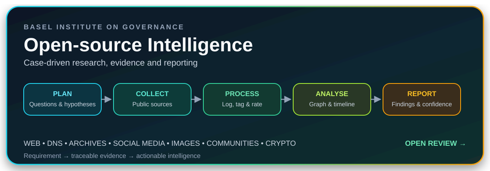
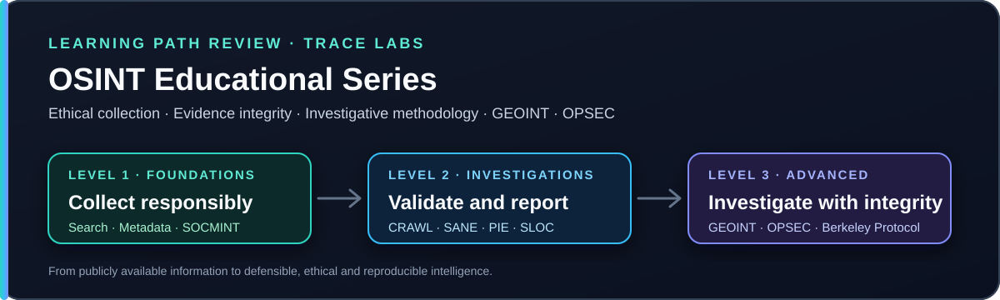
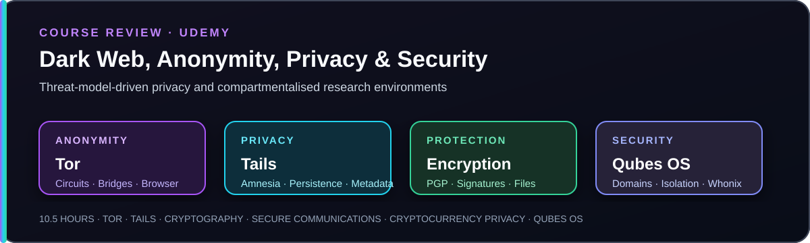

# OSINT & Investigations

[← Back to Learning domains](../README.md)

---

## Open-source Intelligence — Basel Institute on Governance

A free, case-driven course designed primarily for **financial investigators, anti-money laundering and compliance professionals**, while remaining highly relevant to intelligence analysts, journalists, researchers, fraud investigators, and CTI practitioners.

Rather than presenting disconnected tools, the course follows a continuous investigation from the initial requirements to the final analytical report. It connects secure research preparation, source collection, evidence logging, entity relationships, chronology, confidence assessment, reporting, and recipient feedback.

<strong>Open the complete course review →</strong>

 

[Read the complete review](../../OSINT/Learning/Basel-Institute-Open-Source-Intelligence/README.md)

## Trace Labs OSINT Educational Series — Levels 1, 2 and 3

A progressive three-level series that moves from ethical collection and metadata analysis to structured investigations, evidence preservation, OPSEC, GEOINT, due diligence, and the Berkeley Protocol.

The strongest value is methodological rather than tool-driven. The series connects **CRAWL™, SANE, PIE, SLOC, the 4Rs, source validation, proportional collection, reproducible reporting, and high-integrity digital investigation**.

<strong>Open the complete learning path review →</strong>

 

[Read the complete review](../../OSINT/Learning/Trace-Labs-OSINT-Educational-Series/README.md)

## The Ultimate Dark Web, Anonymity, Privacy & Security Course

A practical course on **Tor, Tails, private communications, metadata, PGP, cryptocurrency privacy, Whonix, and Qubes OS**. Although the course is broader than OSINT, the material is highly relevant to sensitive online research, dark-web collection, source protection, and hostile-environment investigation.

The strongest professional takeaway is not anonymity as a guarantee. It is the use of **threat modelling, identity separation, compartmentalisation, encryption, and endpoint containment** to reduce exposure during lawful investigative work.

<strong>Open the complete course review →</strong>

 

[Read the complete review](../../OSINT/Learning/Ultimate-Dark-Web-Anonymity-Privacy-Security/README.md)

