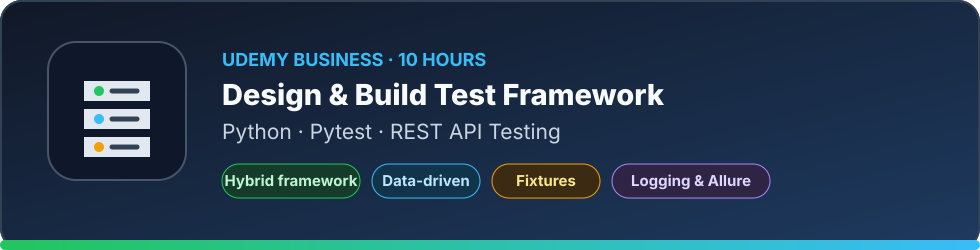

# Python & Engineering

Training and practical resources used to strengthen modern Python engineering, automated testing, API collection, deterministic workflows, and maintainable CTI tooling.

[← Back to Learning & Resources](../README.md)

---

  

<strong>Design & Build Test Framework with Python Pytest | API Tests</strong>

 

A practical course on designing a modular, data-driven and reusable test automation framework with **Python**, **Pytest** and **REST API testing**.

Topics covered include framework architecture, utilities, configuration and test-data management, parameterized tests, setup and teardown, fixture scopes, logging, reporting and Allure.

**My take:** The Python and API introductions are basic for experienced developers and can be reviewed quickly. The strongest value is the quality-engineering perspective on structuring an extensible and maintainable test framework.

**Practical application:** I applied these principles to my CTI vulnerability-intelligence project through API collector tests, reusable fixtures, parametrization, mocked network behaviour, deterministic test data and CI validation.

---

## Short modules & event sessions

Short modules and conference sessions are listed here without individual SVG cards. Each entry records the practical topic and why it matters to the broader learning path.

- **[Advanced testing with pytest](https://learn.microsoft.com/en-us/training/modules/python-advanced-pytest/)**  
  A concise practical module covering parametrization, reusable fixtures, fixture scopes, `yield`-based teardown, `conftest.py`, and `monkeypatch`. The concepts directly support isolated, deterministic tests for HTTP collectors and CTI automation.

<!-- Add short Microsoft Ignite sessions here using the same compact format:
- **[Session title](LINK)**  
  One-sentence summary of the session and its practical relevance.
-->
