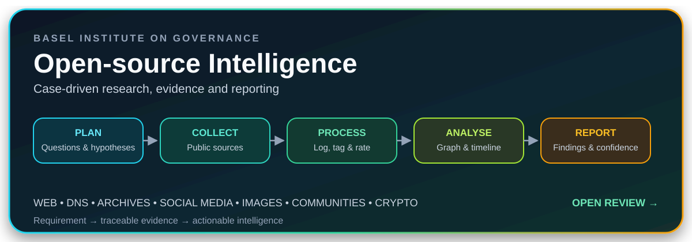

# Open-source Intelligence

[← Back to OSINT Investigations](../../../Learning/domains/osint-investigations.md)

<p align="center">
  
</p>

<p align="center">
  <strong>A case-driven course on structured, secure, and evidence-aware OSINT investigations.</strong>
</p>

---

## Why this course stood out

The strongest feature of this course is its continuity. Instead of presenting disconnected tools, it follows one investigation from the initial requirement to the final report. Each step adds a new piece of information, tests an initial hypothesis, and progressively clarifies the relationships between people, organisations, infrastructure, events, and financial traces.

This case-based approach turns OSINT into an analytical process rather than a collection of searches. The value comes from knowing what question is being answered, preserving where each finding came from, rating the source, distinguishing confirmed from suspected relationships, and explaining the result to a decision-maker.

The training is particularly oriented toward **financial investigations, anti-money laundering, fraud research, compliance, and asset tracing**. Its methodology also transfers naturally to journalism, corporate intelligence, CTI, and other evidence-driven investigations.

---

## The investigation cycle

| Phase | Purpose | Practical outcome |
|---|---|---|
| **Planning and direction** | Define the requirement, questions, and hypotheses. | A focused collection plan instead of uncontrolled searching. |
| **Collection** | Gather information from relevant public sources. | Records, archived pages, infrastructure data, images, social traces, and community findings. |
| **Processing** | Organise, tag, preserve, and prepare raw information. | A traceable evidence register with identifiers, dates, URLs, screenshots, and ratings. |
| **Analysis and production** | Compare sources, assess confidence, map relationships, and build an explanation. | An entity graph, chronology, findings, limitations, and analytical report. |
| **Dissemination and integration** | Deliver the product and incorporate feedback. | Actionable intelligence and new requirements when gaps remain. |

The course makes this cycle tangible by revisiting the same case throughout the sessions. The final report is therefore not a summary of everything found. It is the end product of a controlled chain from requirement to evidence, analysis, and feedback.

---

## Research environment and operational discipline

The investigation begins before the first search. A dedicated and restricted research environment reduces the risks created by unknown websites, downloaded files, and investigator exposure. The course emphasizes an updated system and browser, restricted user permissions, strong credential storage, virtualisation where appropriate, snapshots, and a clean environment that can be archived with the case.

This preparation also supports reproducibility. A preserved environment, search log, and case archive make it easier to explain how information was obtained and to reconstruct the investigation later.

---

## From searches to traceable findings

A simple evidence register is one of the most useful practices introduced in the course.

| Field | Investigative value |
|---|---|
| **ID** | Gives every source and finding a stable reference. |
| **Task** | Connects the search to an investigative requirement. |
| **Source and URL** | Preserves provenance and enables verification. |
| **Date** | Records when the information was observed. |
| **Key information** | Captures the useful fact without copying the entire source. |
| **Tags** | Supports filtering by person, organisation, asset, or event. |
| **Screenshot** | Preserves volatile or changing online content. |
| **Rating** | Separates source reliability from the information itself. |

This structure becomes especially important when official records, archived pages, domain data, social media, and image analysis produce related findings with different levels of reliability.

---

## Investigation surfaces covered

### Web, databases, and infrastructure

The course combines open-web research with databases, public corporate records, DNS and WHOIS information, reverse lookups, historical infrastructure data, cached pages, and web archives. These sources help establish ownership, identify related domains, and recover information that has changed or disappeared.

### Social media and visual evidence

Social platforms can reveal public relationships, activity, locations, and identifiers. Reverse-image search and metadata analysis can connect visual material to a place, account, organisation, or event. These findings still require preservation and corroboration before they support a conclusion.

### Communities, dark web, and virtual currencies

Online communities, onion services, and public blockchain records can reveal advertisements, aliases, transactions, or connections between public and less visible activity. These sources also require stronger operational security and careful confidence assessment.

---

## Turning fragments into intelligence

The investigation culminates in two complementary analytical views.

An **entity and relationship graph** shows people, organisations, assets, domains, and suspected or confirmed links. Consistent symbols and a clear legend prevent the visual from overstating uncertain relationships.

A **timeline** places discoveries and events in sequence. It helps identify changes in activity, compare claims with observable events, and explain how the case evolved.

Together, the graph and timeline turn isolated data points into an intelligible case narrative. The final report then separates the original request, executive summary, detailed findings, confidence, limitations, and recommendations for additional collection.

---

## Confidence and reporting

A useful report must communicate both what was found and how strongly the available information supports each conclusion. The course introduces a confidence approach that combines agreement between sources with the strength of the supporting evidence.

This prevents every finding from being presented with the same certainty. It also creates space for unresolved questions, conflicting information, and recommendations for further collection. Feedback from the recipient closes the intelligence cycle and may generate new requirements.

---

## Key lessons retained

### Requirements prevent search drift

A clear question and hypothesis determine what to collect and when to stop. Tools should serve the investigation, not define it.

### Provenance is part of the finding

A fact without a source identifier, date, capture, and reliability assessment is difficult to verify and weakens the final product.

### Relationships require explicit confidence

An entity graph is powerful, but suspected and confirmed links must remain visually and analytically distinct.

### Reporting is an analytical activity

The report should answer the original request, lead with the most important findings, and explain the evidence, uncertainty, and remaining gaps.

### Feedback belongs inside the cycle

Dissemination is not the end. Questions from the recipient, new information, and unresolved gaps should feed the next planning phase.

---

## Assessment

**Verdict: strongly recommended as a practical foundation in structured OSINT investigation, particularly for financial investigations, fraud, anti-money laundering, compliance, journalism, and intelligence analysis.**

The course is accessible, but the sustained case study gives it more value than a basic catalogue of tools. It demonstrates how secure preparation, disciplined collection, source evaluation, relationship mapping, chronology, confidence, and reporting fit together as one investigative workflow.

For CTI and vulnerability intelligence, the most transferable lesson is the evidence chain:

```text
requirement
→ collection task
→ source
→ finding
→ confidence
→ analytical product
→ feedback
```

That chain is directly applicable to fraud research, infrastructure analysis, actor profiling, source validation, and intelligence reporting.

---

## Publication note

This review documents methodology and personal learning outcomes. It does not reproduce the full course, its answers, or identifying details from the training case.

**Source:** Basel Institute on Governance, Open-source Intelligence course, and personal course notes.
