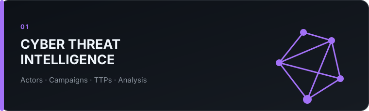
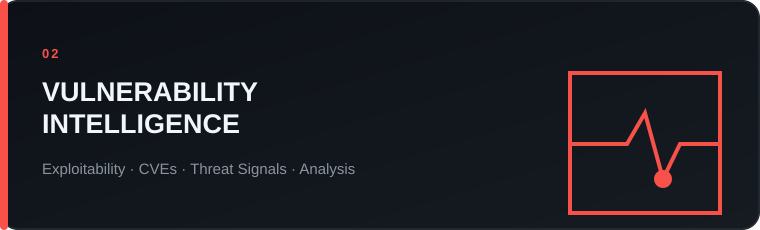
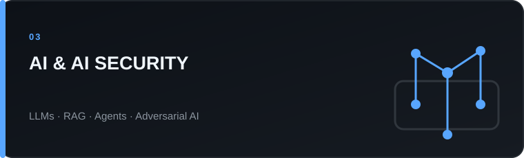
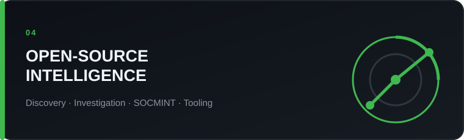
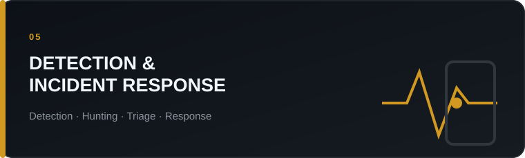
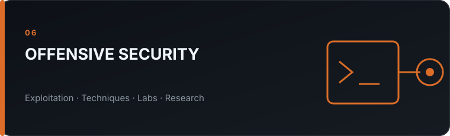
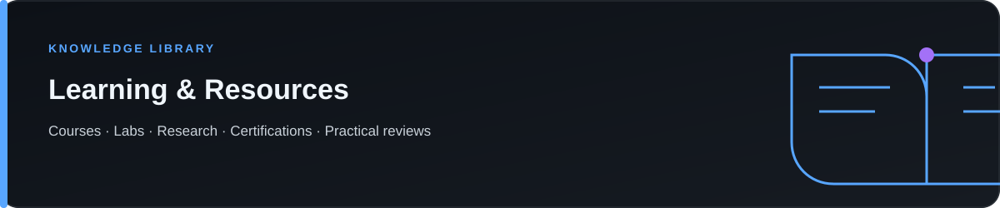
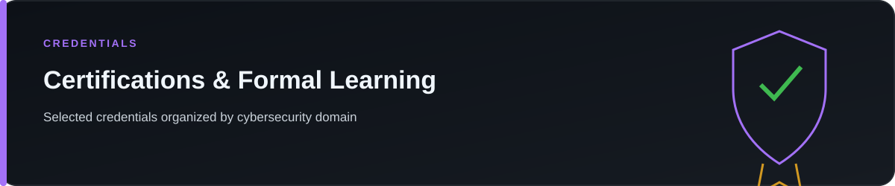

<a href="./CTI/README.md">Threat Intelligence</a> · <a href="./Vulnerability-Research/README.md">Vulnerability Intelligence</a> · <a href="./AI-Security/README.md">AI &amp; AI Security</a> · <a href="./OSINT/README.md">OSINT</a> · <a href="./Detection-IR/README.md">Detection &amp; IR</a> · <a href="./Offensive-Security/README.md">Offensive Security</a> · <a href="./Learning/README.md">Learning &amp; Resources</a>

## Purpose

I am a cybersecurity practitioner with experience across **Security Operations, Incident Response, Vulnerability Management and Cyber Threat Intelligence**.

My current focus sits at the intersection of **Cyber Threat Intelligence, vulnerability intelligence, AI security and OSINT**, with detection engineering and offensive security supporting that work.

This GitHub space brings together the subjects I study, investigate and apply. It is both a **technical learning record** and a **curated cybersecurity knowledge library** covering research, courses, certifications, hands-on labs, methodologies and personal projects.

The objective is not simply to list what I have completed. I want to document **what I learned, what I found useful, how it applies in practice, and enough context to help other practitioners decide what is worth exploring**.

## Explore the domains

<table>
<tr><td width="50%" valign="top">  Structured analysis of adversaries, campaigns and behaviours, from raw reporting to actionable intelligence. Courses, actor and campaign studies, TTP analysis, methodologies and related projects are grouped here.  <a href="./CTI/README.md"><strong>Explore Threat Intelligence →</strong></a></td><td width="50%" valign="top">  Technical understanding of vulnerabilities beyond severity scores: exploitation conditions, attack mechanics, public PoCs, threat signals, labs, courses and prioritization methods.  <a href="./Vulnerability-Research/README.md"><strong>Explore Vulnerability Intelligence →</strong></a></td></tr>
<tr><td width="50%" valign="top">  Modern AI systems, cloud AI, LLMs, RAG, agents and the security assumptions and attack surfaces introduced by these architectures. Learning resources and projects are integrated here.  <a href="./AI-Security/README.md"><strong>Explore AI &amp; AI Security →</strong></a></td><td width="50%" valign="top">  Investigation methodologies, source discovery, practical tooling and repeatable workflows for collecting, validating and applying publicly available intelligence.  <a href="./OSINT/README.md"><strong>Explore OSINT →</strong></a></td></tr>
<tr><td width="50%" valign="top">  Translating adversary behaviours and threat intelligence into detection opportunities, threat hunting, investigations and operational response.  <a href="./Detection-IR/README.md"><strong>Explore Detection &amp; IR →</strong></a></td><td width="50%" valign="top">  Hands-on exploration of attack techniques to better understand exploitability, adversary tradecraft and defensive opportunities. Platforms are treated as learning sources, not as domains.  <a href="./Offensive-Security/README.md"><strong>Explore Offensive Security →</strong></a></td></tr>
</table>

The learning library is a major part of this GitHub space. It brings together **courses, labs, research papers, documentation, certifications and high-value resources** across all cybersecurity domains.

Resources are organized by **subject**, not by provider. A TryHackMe AI module belongs under **AI &amp; AI Security**. A vulnerability exploitation challenge belongs under **Vulnerability Intelligence** or **Offensive Security**. An OSINT room belongs under **OSINT**.

For substantial resources, I document:

- **Time**: the realistic learning commitment;
- **Difficulty**: introductory, intermediate or advanced;
- **Hands-on**: how practical the material is;
- **Verdict**: recommended, situational or reference;
- **Scope**: what the resource actually covers;
- **Audience**: who is likely to benefit from it;
- **Limitations**: what is missing, dated or too superficial;
- **Application**: how the knowledge connects to real security work.

I do not use arbitrary numerical scores. Detailed notes explain why a resource may or may not be worth exploring.

<a href="./Learning/README.md"><strong>Browse all learning paths and resource reviews →</strong></a>

Certifications support the domains documented above, but they are not presented as a trophy wall. They are organized by subject and connected to the related learning, labs and projects.

<a href="./Certifications/README.md"><strong>View certifications and formal learning →</strong></a>

## A non-linear path into cybersecurity

My route into cybersecurity has not been conventional. It started with **mathematics then theoritical physics**, scientific research (Mesoscopic physics = Quantum mechanics) and telecommunications. From there, I moved into software development, cryptography, consulting and eventually cybersecurity (formation in University of Toulouse).

My security work has since crossed **SOC operations, incident response, governance, vulnerability management and Cyber Threat Intelligence**.

<a href="./About/Career-Journey.md"><strong>Read the full career journey →</strong></a>

## Beyond cybersecurity

For more than twenty years, I have developed a sustained expertise and personal research interest in **Iran**, including its history, political system, society, geopolitics and regional dynamics.

My other interests include literature, philosophy, journalism and science. Across all of them, the common thread is the same: **understanding complex systems, competing narratives and the evidence behind them**.

<a href="https://linkedin.com/in/frédéric-chalin-28707247">LinkedIn</a> · <a href="https://github.com/Guotepauc">GitHub</a>  Research · Learn · Build · Share

